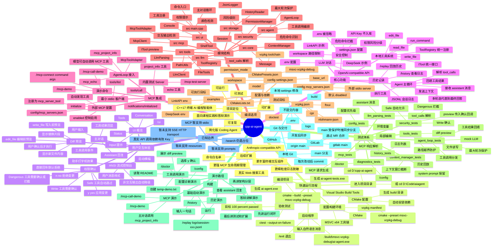

# cpp-ai-agent —— 项目思维导图

> 用于答辩展示、项目复盘和快速讲解。结构参考终端演示记录，从“如何跑起来”扩展到“项目做了什么、怎么实现、如何验收、后续如何扩展”。

## Mermaid 思维导图

## 讲解顺序建议

1. 先从终端记录切入：项目能配置、能构建、能运行、能对话。
2. 再讲主线闭环：用户输入、模型决策、工具调用、权限确认、结果回填。
3. 然后展开工程结构：`agent`、`llm`、`tools`、`security`、`ui`、`mcp`、`storage`。
4. 接着讲安全与可控性：路径限制、风险分级、diff 预览、选项式确认。
5. 最后讲测试和交付：自动化测试、历史回放、GitHub/GitLab 同步、后续扩展。
