# cpp-ai-agent —— 项目思维导图

> 这版使用兼容性更高的 Mermaid `graph LR`，避免 `mindmap` 语法在部分渲染器中报错。节点尽量短，重点用分支和连线体现项目逻辑。

## Mermaid 思维导图

```mermaid
graph LR
    A["cpp-ai-agent<br/>C++ 终端 AI 编程智能体"]

    A --> B["项目目标"]
    B --> B1["可运行"]
    B --> B2["可测试"]
    B --> B3["可扩展"]
    B --> B4["可演示"]

    A --> C["运行闭环"]
    C --> C1["进入目录"]
    C1 --> C1a["D:/cpp-ai-agent"]
    C --> C2["配置构建"]
    C2 --> C2a["cmake --preset"]
    C --> C3["编译"]
    C3 --> C3a["ai-agent.exe"]
    C3 --> C3b["ai-agent-tests.exe"]
    C --> C4["启动对话"]
    C4 --> C4a["用户输入"]
    C4a --> C4b["模型回复"]
    C4b --> C4c["/exit 退出"]

    A --> D["Agent 主流程"]
    D --> D1["用户问题"]
    D1 --> D2["上下文窗口"]
    D2 --> D3["LLM 推理"]
    D3 --> D4{"需要工具?"}
    D4 -->|否| D5["直接回答"]
    D4 -->|是| D6["生成 tool_call"]
    D6 --> D7["权限判断"]
    D7 --> D8["执行工具"]
    D8 --> D9["结果回填"]
    D9 --> D3

    A --> E["核心模块"]
    E --> E1["main<br/>命令入口"]
    E --> E2["agent<br/>主循环"]
    E --> E3["llm<br/>API + 解析"]
    E --> E4["tools<br/>本地工具"]
    E --> E5["security<br/>权限控制"]
    E --> E6["ui<br/>控制台呈现"]
    E --> E7["mcp<br/>工具协议"]
    E --> E8["storage<br/>日志回放"]

    E2 --> F["上下文管理"]
    F --> F1["保留 system"]
    F --> F2["限制窗口"]
    F --> F3["保留最新消息"]

    E4 --> G["工具能力"]
    G --> G1["read_file"]
    G --> G2["write_file"]
    G --> G3["edit_file"]
    G --> G4["run_command"]
    G --> G5["ToolRegistry"]

    A --> H["安全交互"]
    H --> H1["风险分级"]
    H1 --> H1a["Safe"]
    H1 --> H1b["Write"]
    H1 --> H1c["Dangerous"]
    H --> H2["Diff 预览"]
    H2 --> H2a["写入前展示"]
    H2 --> H2b["编辑前展示"]
    H --> H3["选中确认"]
    H3 --> H3a["方向键切换"]
    H3 --> H3b["高亮变化"]
    H3 --> H3c["回车执行"]
    H --> H4["危险命令"]
    H4 --> H4a["删除文件"]
    H4 --> H4b["reset/shutdown"]
    H4 --> H4c["先询问用户"]

    A --> I["MCP 集成"]
    I --> I1["stdio client"]
    I1 --> I1a["initialize"]
    I1 --> I1b["tools/list"]
    I1 --> I1c["tools/call"]
    I --> I2["内置 server"]
    I2 --> I2a["echo"]
    I2 --> I2b["project_info"]
    I --> I3["Agent 接入"]
    I3 --> I3a["McpToolAdapter"]
    I3 --> I3b["mcp_echo"]
    I3 --> I3c["mcp_project_info"]
    I --> I4["外部配置"]
    I4 --> I4a["mcp_servers.json"]
    I4 --> I4b["自动发现"]
    I4 --> I4c["自动注册"]

    A --> J["配置依赖"]
    J --> J1["CMake"]
    J --> J2["vcpkg"]
    J --> J3["cpr"]
    J --> J4["nlohmann-json"]
    J --> J5["doctest"]
    J --> J6["ftxui"]
    J --> J7[".env/settings"]

    A --> K["测试验收"]
    K --> K1["单元测试"]
    K1 --> K1a["config"]
    K1 --> K1b["tools"]
    K1 --> K1c["security"]
    K1 --> K1d["agent_loop"]
    K1 --> K1e["mcp"]
    K --> K2["手动演示"]
    K2 --> K2a["/doctor"]
    K2 --> K2b["/ui"]
    K2 --> K2c["/mcp-demo"]
    K2 --> K2d["/history"]
    K --> K3["验收标准"]
    K3 --> K3a["构建成功"]
    K3 --> K3b["100% tests passed"]
    K3 --> K3c["功能可演示"]

    A --> L["交付同步"]
    L --> L1["本地提交"]
    L1 --> L1a["git commit"]
    L --> L2["GitHub"]
    L2 --> L2a["origin/main"]
    L --> L3["GitLab"]
    L3 --> L3a["保护分支"]
    L3 --> L3b["同步分支"]
    L3 --> L3c["Merge Request"]
    L --> L4["不提交"]
    L4 --> L4a["build/"]
    L4 --> L4b["logs/"]
    L4 --> L4c[".env"]

    A --> M["后续扩展"]
    M --> M1["真实搜索"]
    M --> M2["MCP resources"]
    M --> M3["MCP prompts"]
    M --> M4["HTTP/SSE transport"]
    M --> M5["更细日志脱敏"]

    classDef center fill:#1f2937,color:#ffffff,stroke:#111827,stroke-width:2px;
    classDef branch fill:#dbeafe,stroke:#2563eb,color:#111827;
    classDef leaf fill:#f8fafc,stroke:#94a3b8,color:#111827;
    classDef decision fill:#fef3c7,stroke:#d97706,color:#111827;
    classDef safety fill:#fee2e2,stroke:#dc2626,color:#111827;
    classDef mcp fill:#dcfce7,stroke:#16a34a,color:#111827;

    class A center;
    class B,C,D,E,J,K,L,M branch;
    class D4 decision;
    class H,H1,H2,H3,H4 safety;
    class I,I1,I2,I3,I4 mcp;
```

## 讲解逻辑

1. 先讲中心：这是一个 C++ 终端 AI 编程智能体。
2. 再讲闭环：用户输入、LLM 判断、工具调用、权限确认、结果回填。
3. 然后讲分层：`agent` 负责编排，`tools` 负责能力，`security` 负责安全，`ui` 负责交互，`mcp` 负责外部工具扩展。
4. 最后讲验收：构建、测试、演示命令、GitHub/GitLab 同步。
