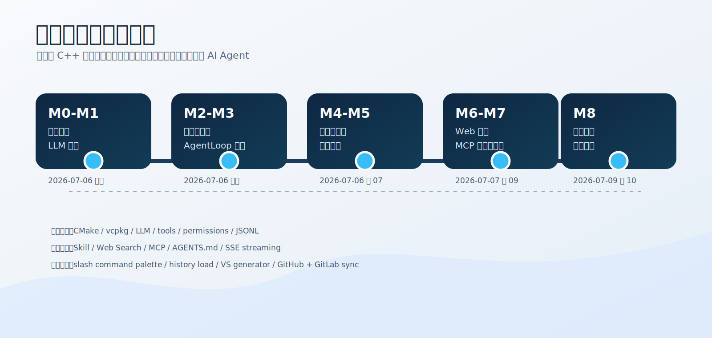
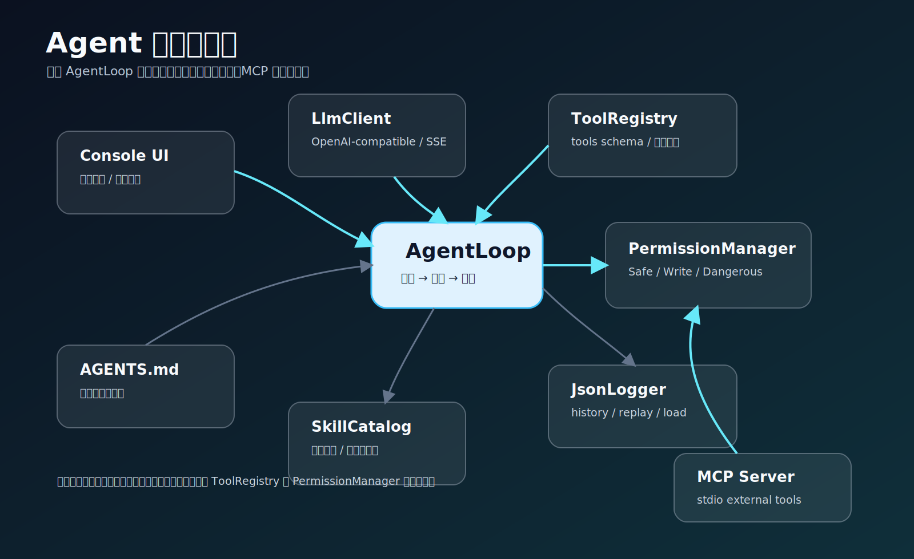
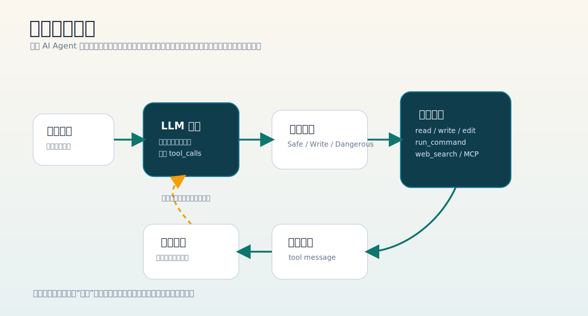
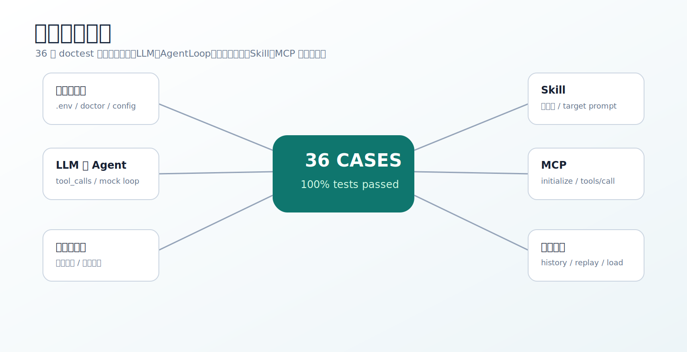
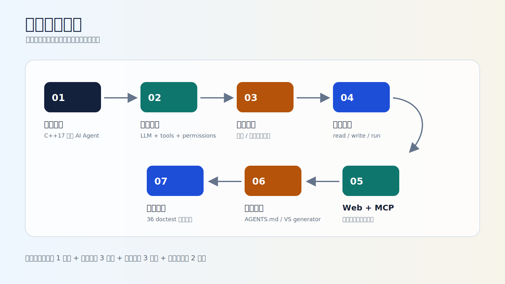

# cpp-ai-agent 小组第一周项目总周报

**报告周期：** 2026-07-06 至 2026-07-11
**项目名称：** cpp-ai-agent
**项目阶段：** M0-M8 演示闭环完成，进入阶段验收准备
**报告日期：** 2026-07-11



---

## 1. 本周总览

本周小组围绕“用 C++17 实现一个终端 AI 编程智能体”的课程实践目标，完成了从工程骨架到完整演示闭环的集中开发。项目已经从最小可运行程序推进到具备 LLM 对话、工具调用、安全确认、日志回放、流式控制台、Skill 工作模式、Web 搜索、MCP 最小客户端和跨环境稳定性的阶段版本。

本周工作可以概括为三条主线：

| 主线 | 本周结果 | 阶段价值 |
|------|----------|----------|
| 核心 Agent 闭环 | 完成 M0-M5：构建、LLM、工具、AgentLoop、安全日志、演示入口 | 证明项目不是静态脚本，而是可运行的 AI Agent |
| 扩展能力 | 完成 M6-M7：Web 搜索、MCP 最小客户端、Skill 和流式控制台 | 展示项目可扩展到外部知识和外部工具 |
| 工程稳定 | 完成 M8：AGENTS.md、VS generator、中文参数、GitHub/GitLab 同步、`/load` 修复 | 提升项目在不同 Windows 环境下的可复现性 |

---

## 2. 阶段里程碑


### M0-M5：核心闭环

| 阶段 | 完成内容 | 演示价值 |
|------|----------|----------|
| M0 | CMake 最小工程骨架 | 项目可编译、可运行 |
| M0.5 | vcpkg、CMakePresets、配置文件、测试目录 | 项目工程化 |
| M1 | LLM 客户端和基础对话 | 能接入大模型 |
| M2 | 工具接口、工具注册表、文件/命令工具 | 模型可请求程序执行动作 |
| M3 | AgentLoop 主循环 | 形成“模型 -> 工具 -> 结果回填”闭环 |
| M4 | 权限确认、危险命令、JSONL 日志、历史回放 | 具备安全与可追溯性 |
| M5 | `/demo`、`/doctor`、`/ui`、Skill、演示文档 | 形成可验证的阶段交付版本 |

### M6-M8：扩展与稳定

| 阶段 | 完成内容 | 演示价值 |
|------|----------|----------|
| M6 | `web_search`、`/search`、Bing RSS 优先、代理配置、中文编码修复 | Agent 可接触外部信息 |
| M7 | MCP stdio 客户端、内置测试 server、MCP 工具适配 | Agent 可通过标准协议连接外部工具 |
| M8 | AGENTS.md、VS generator、中文参数、Git 同步、`/load` 修复 | 跨环境构建和运行更稳定 |

---

## 3. 当前系统架构



系统结构如下：

1. 用户从终端输入需求。
2. `main.cpp` 负责命令解析、配置读取和模块装配。
3. `AgentLoop` 把上下文、tools schema 和 system prompt 发给模型。
4. 模型返回自然语言或 `tool_calls`。
5. 工具调用先经过权限控制，再执行真实本地操作。
6. 工具结果回填给模型，模型继续推理或给出最终回答。
7. 全过程通过 JSONL 日志记录，可 `/history`、`/replay`、`/load`。

---

## 4. 核心能力闭环



这条闭环是本项目的核心价值。它说明项目不是“把模型回复打印出来”，而是让模型能够在受控条件下请求本地工具，程序负责安全执行、记录过程并把结果交还给模型。

---

## 5. 本周功能完成情况

### 5.1 LLM 与流式输出

- 支持 OpenAI-compatible `/chat/completions`。
- 支持 LinkAPI、DeepSeek 等 Provider 配置。
- 支持 `.env`、系统环境变量和 `config/settings.json` 配置优先级。
- 同步完成 SSE 流式输出升级，Console 可逐 token 平滑输出。
- 新增 `ILlmClient` 接口，便于 mock LLM 单元测试。

### 5.2 工具系统与安全控制

- 完成 `ITool`、`ToolRegistry`、tools schema 生成。
- 内置工具包括：
  - `read_file`
  - `write_file`
  - `edit_file`
  - `list_dir`
  - `run_command`
  - `web_search`
- 完成 workspace 路径越界防护。
- 写入和编辑文件前显示 diff preview。
- 命令执行和危险操作进入权限确认流程。

### 5.3 日志、回放和恢复

- 使用 JSONL 记录用户消息、助手消息、工具调用和工具结果。
- `/history` 列出历史日志。
- `/replay logs\session-xxx.jsonl` 回放历史。
- `/load` 支持加载历史会话继续对话。
- 修复 `/load` 选择器显示空日志、当前日志、损坏日志的问题。
- 日志文件名增加毫秒和进程 ID，避免同秒启动冲突。

### 5.4 Web 搜索

- 新增 `/search <query>` 和 `web_search` 工具。
- 国内网络优先使用 Bing RSS。
- DuckDuckGo 和 Bing 搜索链接作为兜底。
- 支持 `WEB_SEARCH_PROXY_URL` 专用代理。
- 修复中文 GBK 编码导致 JSON 解析崩溃的问题。

### 5.5 MCP 最小客户端

- 实现 stdio MCP 初始化和工具发现。
- 实现 `tools/list` 和 `tools/call`。
- 新增内置 MCP 测试 server。
- 新增演示命令：
  - `/mcp-demo`
  - `/mcp-call-demo`
  - `/mcp-connect <command> [args...]`
- 支持 `config/mcp_servers.json` 启用外部 MCP server。

### 5.6 Skill 与 AGENTS.md

- Skill 支持 `/skills`、`/use-skill <name> [target]`、`/clear-skill`。
- 内置 `code_review`、`cpp_debug`、`project_summary`、`test_writer`。
- Skill 支持 `allowed_tools` 白名单，AgentLoop 进行程序级硬拦截。
- `AGENTS.md` 启动时自动读取并追加到 system prompt，提供项目级规范。

### 5.7 演示体验

- `/`、`/?`、`/help`、`/commands` 打开命令面板。
- 命令面板按“主对话命令 / 独立运行命令 / 内部命令”分组。
- `/ui` 展示 Conversation / Tools / Status / Input 概览。
- `/demo` 提供演示脚本。
- `/doctor` 提供配置诊断。

---

## 6. 团队分工与贡献

| 成员 | 本周主要贡献 | 对应模块 / 文档 |
|------|--------------|-----------------|
| 樊浩 | 总体集成、三端同步、冲突处理、答辩主线梳理、演示入口统一、文档覆盖检查 | `main.cpp`、README、演示说明、答辩提纲、测试报告、团队分工、第一周周报 |
| 王博轩 | LLM 接入、AgentLoop 主循环、tool_calls 解析、上下文管理与 AGENTS.md 规范注入 | `src/llm`、`src/agent`、`src/core`、`AGENTS.md` |
| 康艺凡 | 工具系统、安全确认、路径越界防护、diff preview、JSONL 日志与历史回放 | `src/tools`、`src/security`、`src/storage`、测试报告 |
| 魏宇鑫 | Console UI、Skill、MCP 最小客户端、Web 搜索、扩展能力说明 | `src/ui`、`src/skills`、`src/mcp`、`src/tools/WebSearchTool.*` |

---

## 7. 测试与验收

本周持续使用以下命令作为主验收流程：

```powershell
cmake --preset msvc-vcpkg-debug
cmake --build --preset msvc-vcpkg-debug
cd build\msvc-vcpkg-debug
ctest -C Debug --output-on-failure
```

当前测试报告显示：

```text
100% tests passed, 0 tests failed
36 doctest test cases passed
```

### 测试覆盖图



### 手动验收入口

| 演示点 | 命令或输入 | 说明 |
|--------|------------|------|
| 配置诊断 | `ai-agent.exe /doctor` | 检查 API、模型、workspace、vcpkg |
| 命令面板 | 主对话输入 `/` | 集中查看功能入口 |
| 文件读取 | `请读取 README.md 并总结` | 验证 `read_file` 工具调用 |
| 权限确认 | `请创建 temp-demo.txt` | 验证 diff preview 和 yes/no |
| Web 搜索 | `ai-agent.exe /search "MCP 是什么"` | 验证中文参数和搜索结果 |
| Skill | `/use-skill code_review src/mcp` | 验证专家模式和工具白名单 |
| MCP | `ai-agent.exe /mcp-demo` | 验证 stdio 握手和工具发现 |
| 历史 | `ai-agent.exe /history` / `/replay` / `/load` | 验证追溯、回放和续接 |

---

## 8. 阶段演示建议

### 8.1 讲解顺序



### 8.2 现场串讲口径

> 我们第一周完成的是一个最小但完整的 AI Coding Agent。它不是只会聊天，而是具备“模型决策、工具调用、安全确认、结果回填、日志追踪”的闭环。M0-M5 保证核心 Agent 能跑起来，M6-M7 增加 Web 搜索和 MCP 外部工具扩展，M8 解决新电脑构建、中文参数、项目规范注入和多端同步等工程化问题。当前 36 个 doctest 测试全部通过，演示入口也已通过 `/` 命令面板集中展示。

---

## 9. 风险与应对

| 风险 | 影响 | 已采取措施 | 下步计划 |
|------|------|------------|----------|
| 现场网络不稳定 | `/search` 失败或超时 | Bing RSS 优先、代理配置、兜底链接 | 准备离线搜索结果 |
| API Key 或模型配置错误 | LLM 无法响应 | `/doctor`、模型名误拼纠正、配置优先级说明 | 答辩前固定 `.env` |
| Windows 构建环境差异 | 新电脑构建失败 | VS generator 默认、NMake 备用、vcpkg 文档 | 演示机提前复测 |
| GitHub/GitLab 分叉 | 版本混乱 | 负责人统一同步、同步分支 MR | 答辩前冻结主分支 |
| 自驱动大任务不稳定 | 综合演示失控 | 暂不强行合入主线 | 先做可控脚本验证 |

---

## 10. 下周计划

1. **完成答辩排练。**
   每位成员按负责模块准备 2-3 分钟讲解，能指出代码目录、测试文件和演示命令。

2. **冻结稳定版本。**
   答辩前减少临时大改动，只接受 bugfix 和文档修正。

3. **准备综合演示。**
   评估“PPT 生成”或“小游戏生成”作为自驱动任务闭环展示，要求可控、可回退。

4. **完善风险预案。**
   准备网络失败、模型不可用、外部 MCP server 不可用时的替代演示路线。

5. **继续补充周报与答辩材料。**
   将个人周报、小组周报、测试报告和答辩提纲保持同步。

---

## 11. 本周结论

本周项目已经完成从“能运行”到“能演示、能测试、能扩展、能解释”的阶段跃迁。
当前版本具备清晰的 AI Agent 主循环、可控的工具执行、安全权限机制、可追溯日志、Web 搜索和 MCP 扩展能力，也具备面向答辩的文档和演示路线。

下一阶段重点不再是盲目增加功能，而是压实稳定性、统一讲解口径，并选择一个能够体现综合能力的大任务作为阶段演示亮点。
